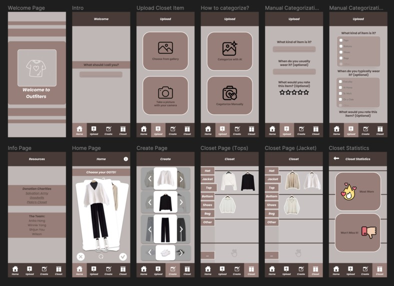

# DigitalCloset

Our inspiration comes from our troubles with creating different everyday outfits. Sometimes we forget what we have in our closet and the clothes that we don't need pile up. We target this app to people like Steve Jobs who only wear one outfit because choosing an outfit is just too time and energy-consuming as well as others who need a little help with spring cleaning!

Our app is a smart closet app that helps you put together an outfit effortlessly using all the items in your closet. It inventories and categories your closet to create new endless outfit combinations and recommendations. You can upload and scan your clothes with an Apparel Classification AI and it will create smart combinations using Fashion Design AI. With a swiping Tinder-like UI, you can generate a new OOTD to wear if you do not like it!

With Simple-statistics, Outfitter will remind you about clothes that you haven't touched in a while and suggest maybe you donate them. You will also be able to find clothes that you enjoy so you know what kinds of clothes to purchase in the future.
